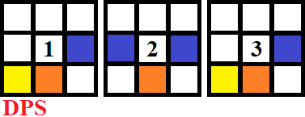
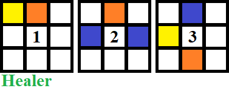
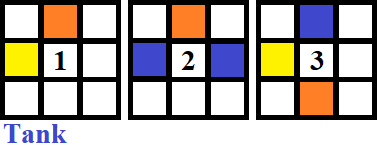
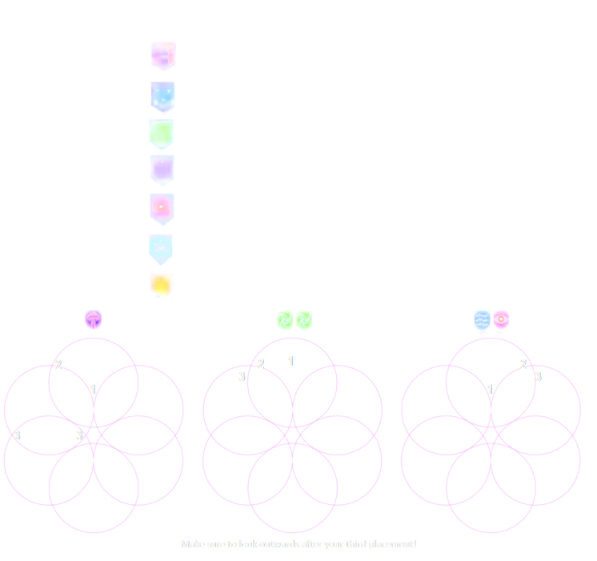

# FF14 - Macros and waymarks
Macros and waymarks for some of the extreme and savage fights. These may or may not be specific for some specific strategy, but I've used these myself.

* [Extremes](#extremes)
  * [Hades / The Minstrel's Ballad: Hades's Elegy](#hades--the-minstrels-ballad-hadess-elegy)
    * [Macro](#macro)
    * [Waymarks](#waymarks)
  * [Varis yae Galvus / Memoria Misera](#varis-yae-galvus--memoria-misera)
    * [Macro](#macro-1)
    * [Waymarks](#waymarks-1)
  * [Warrior of Light / Seat of Sacrifice](#warrior-of-light--seat-of-sacrifice)
    * [Macro](#macro-2)
    * [Waymarks](#waymarks-2)
* [Savages](#savages)
  * [E9S - Umbra](#e9s---umbra)
    * [Macro](#macro-3)
    * [Waymarks](#waymarks-3)
    * [Links](#links)
  * [E10S - Litany](#e10s---litany)
    * [Macro](#macro-4)
    * [Waymarks](#waymarks-4)
    * [Links](#links-1)
  * [E11S - Anamorphosis](#e11s---anamorphosis)
    * [Macro](#macro-5)
    * [Waymarks](#waymarks-5)
    * [Links](#links-2)
  * [E12S - Eternity](#e12s---eternity)
    * [Macro](#macro-6)
    * [Waymarks](#waymarks-6)
    * [Titan position images](#titan-position-images)
    * [Intermediate / Advanced Relativity image](#intermediate--advanced-relativity-image)
    * [Links](#links-3)

## Extremes
### Hades / The Minstrel's Ballad: Hades's Elegy
#### Macro
```
┏━━━ Spread ━━━┓┏━━ Stack groups ━━┓
┃　　　　　　　　┃┃　　  　　　　　  ┃
┃　　  　  　　┃┃     　   ┃
┃　　  　　  ┃┃     　   ┃
┃　　  　  　　┃┣━━━   Towers   ━━━┫
┃　　　　　　　　┃┃ ━ NorthEast　  ┃
┣━  Ascian Prime   ━┫┃ ━ SouthWest　┃
┃　　　　　　　　┃┣━  Ice knockback  ━━┫
┃　　　　　　　　┃┃　　　　　　　┃
┃    ┃┃　　　　　　　　┃
┃　　　　　　　　┃┃　　　　　　　┃
┃　　　　　　　　┃┗━━━━━━━━━━━┛
┗━━━━━━━━━━┛
TANK ADDS at NE/NW to grab tethers, healers grab S tethers
```


#### Waymarks
```json
{"Name":"Hades Ex","MapID":693,"A":{"X":100.0,"Y":0.0,"Z":81.0,"ID":0,"Active":true},"B":{"X":119.0,"Y":0.0,"Z":100.0,"ID":1,"Active":true},"C":{"X":100.0,"Y":0.0,"Z":119.0,"ID":2,"Active":true},"D":{"X":81.0,"Y":0.0,"Z":100.0,"ID":3,"Active":true},"One":{"X":95.0,"Y":0.0,"Z":100.0,"ID":4,"Active":true},"Two":{"X":105.0,"Y":0.0,"Z":100.0,"ID":5,"Active":true},"Three":{"X":0.0,"Y":0.0,"Z":0.0,"ID":6,"Active":false},"Four":{"X":0.0,"Y":0.0,"Z":0.0,"ID":7,"Active":false}}
```

### Varis yae Galvus / Memoria Misera
#### Macro
```
┏━━ Spread ━━┓┏━━━ Stacks ━━━━┓
　　　  　　　  　　　West/North
　　　　　　　   
　　　
　　　　　　　　East/South
　　　  　　　  　　   
┏━    Crosses    ━┓┏━━━  Shields  ━━━┓
　 Red = Out　　   　　 Loaded = Spread
　 Green = In　　  　　 Electric = Knockback
　 Blue = Bait N/S 　　 Reinforced = Reflect
┏━━━━ Gunshield Spark Spread ━━━━┓
                                         
                                         
                                      
                                   
```


#### Waymarks
```json
{"Name":"Varis / Memoria Misera Ex","MapID":725,"A":{"X":24.0,"Y":-24.0,"Z":-694.0,"ID":0,"Active":true},"B":{"X":46.0,"Y":-24.0,"Z":-694.0,"ID":1,"Active":true},"C":{"X":46.0,"Y":-24.0,"Z":-672.0,"ID":2,"Active":true},"D":{"X":24.0,"Y":-24.0,"Z":-672.0,"ID":3,"Active":true},"One":{"X":35.0,"Y":-24.0,"Z":-698.0,"ID":4,"Active":true},"Two":{"X":50.0,"Y":-24.0,"Z":-683.0,"ID":5,"Active":true},"Three":{"X":35.0,"Y":-24.0,"Z":-668.0,"ID":6,"Active":true},"Four":{"X":20.0,"Y":-24.0,"Z":-683.0,"ID":7,"Active":true}}
```

### Warrior of Light / Seat of Sacrifice
#### Macro
```
┏━━ Spread ━━┓┏━ LB1 ━┓┏━  BLM  ━━┓
　　　　　　　　　 North　　 + 1+5 
　　  　　　　   East　　　 + 2+6
　　   　　　  South　　 + 3+7
　　  　　　　　　　　　　　+ 4+8
　　　　　　　 　┗━━━━┛┗━━━━━━┛
┏━━ Pairs / LB3 ━━┓┏━━━ LB2 ━━━┓
　 　 　　West
　　　　　 　　　　　　　   
　 　 　　East
　■ Rotate clockwise　　   
┏━━━━━━   Imbued Saber   ━━━━━━┓
　Stone = Spread　Fire = Stop　Glow = In
　Holy = Stack　　  Ice = Move　None = Out
┗━   Adds tethers:　 South　 North  ━┛
```


#### Waymarks
```json
{"Name":"WoL / Seat of Sacrifice Ex","MapID":739,"A":{"X":82.0,"Y":0.0,"Z":82.0,"ID":0,"Active":true},"B":{"X":118.0,"Y":0.0,"Z":82.0,"ID":1,"Active":true},"C":{"X":118.0,"Y":0.0,"Z":118.0,"ID":2,"Active":true},"D":{"X":82.0,"Y":0.0,"Z":118.0,"ID":3,"Active":true},"One":{"X":90.0,"Y":0.0,"Z":100.0,"ID":4,"Active":true},"Two":{"X":110.0,"Y":0.0,"Z":100.0,"ID":5,"Active":true},"Three":{"X":0.0,"Y":0.0,"Z":0.0,"ID":6,"Active":false},"Four":{"X":0.0,"Y":0.0,"Z":0.0,"ID":7,"Active":false}}
```

## Savages
### E9S - Umbra
#### Macro
```
┏━━ Spread ━━┓┏━━ Flower ━━┓
　　　　　　　　　　　　
　　  　　　　　　　　　
　　   　　　　　　　 
　　  　　　　　　　　　
　　　　　　　　　　　　    
┗  DPS clockwise ┛┗━━━━━━━━┛
Chains: / N/W - / S/E
┏━━ Platform ━┓┏━━ Tower ━━┓
　　　　　　　　　　　　　
　　　　　　　　　　　　
    　　　　  
　　　　　　　　　　　　
　　　　　　　　　　　　　
┗━━━━━━━━┛┗━━━━━━━━┛
```


#### Waymarks
```json
{"Name":"E09S Umbra","MapID":750,"A":{"X":93.0,"Y":0.0,"Z":89.0,"ID":0,"Active":true},"B":{"X":107.0,"Y":0.0,"Z":89.0,"ID":1,"Active":true},"C":{"X":111.0,"Y":0.0,"Z":107.0,"ID":2,"Active":true},"D":{"X":89.0,"Y":0.0,"Z":107.0,"ID":3,"Active":true},"One":{"X":89.0,"Y":0.0,"Z":93.0,"ID":4,"Active":true},"Two":{"X":111.0,"Y":0.0,"Z":93.0,"ID":5,"Active":true},"Three":{"X":107.0,"Y":0.0,"Z":111.0,"ID":6,"Active":true},"Four":{"X":93.0,"Y":0.0,"Z":111.0,"ID":7,"Active":true}}
```

#### Links
* [Umbra Strategy Guide](https://saltedxiv.com/guides/edens-promise-umbra-savage-raid-strategy-guide)
* ["Braindead" "Maximum Kev" safe spot strategy for summon clones](https://www.youtube.com/watch?v=m5x7sbANnHs&t=6s)

### E10S - Litany
#### Macro
```
┏━ Shadow Cleave ━┓┏━ Voidgate Pairs ━┓
  　　　　　　　　　　　　　　　
  　　  　  　　　　　　　　　
  　　     　　　　       
  　　  　　　　　　　　　　  
　　　　　　　　　　　　　　　  
┗━━━━━━━━━━┛┗━━━━━━━━━━┛
┏  Voidgate 2 Part 1   ┓┏  Voidgate 2 Part 2   ┓
 　● 　  → ●　　　　　　 
 　↑　　　　　　　　　　　　　　　   ●
   　　　　　　　　● 　 ●
   　　　　　　　　　　　　　 ●
 　　　　　　　　　↓　　　　　　 
 　● ←  　 ●　　┗   Pairs move CW    ┛
┗    Clone in corner   ┛
```


Additional macro
```
┏━━━  Around Orbs  ━━━┓
　,  North and go counterclockwise
　,  North-East and go clockwise
┏━━━━ Side Orbs ━━━━┓
　,  Leftmost orb
　,  Rightmost orb
┏━━━ Shackled Apart ━━━┓
　/ north
　DPS south
┏━━━ Shackled Together ━━━┓
　DPS adjust to their tethered pair
```


#### Waymarks
```json
{"Name":"E10S Litany","MapID":748,"A":{"X":100.0,"Y":0.0,"Z":85.0,"ID":0,"Active":true},"B":{"X":115.0,"Y":0.0,"Z":100.0,"ID":1,"Active":true},"C":{"X":100.0,"Y":0.0,"Z":115.0,"ID":2,"Active":true},"D":{"X":85.0,"Y":0.0,"Z":100.0,"ID":3,"Active":true},"One":{"X":85.0,"Y":0.0,"Z":85.0,"ID":4,"Active":true},"Two":{"X":115.0,"Y":0.0,"Z":85.0,"ID":5,"Active":true},"Three":{"X":115.0,"Y":0.0,"Z":115.0,"ID":6,"Active":true},"Four":{"X":85.0,"Y":0.0,"Z":115.0,"ID":7,"Active":true}}
```

#### Links
* [Litany Strategy Guide](https://saltedxiv.com/guides/edens-promise-litany-savage-raid-strategy-guide)

### E11S - Anamorphosis
#### Macro
```
┏━━  Protean  ━━┓┏━━ Shining Sky   ━━┓
　　　　 　　　　　   Lightning + Tanks: N
　　  　　　　      Fire:  Stack (S)
　  　    　　  ┗━━━━━━━━━━━┛
　　  　　　　  ┏━ Cycles of Faith ━━┓
　　　　 　　　　　  Fire: Protean → Pairs
　　　　　　　　　　　   Line → KB → Stack (S)
  Fire: DPS clockwise
  Lightning: / out     Lightning: Protean → Spread
  Holy:　　　　　　　　   Line → Out → Prey (N)
       North
       West　　　　　　  Holy: Protean → Cones
       East　　　　　　    Line → Bait → Prey (N)
┗━━━━━━━━━┛┗━━━━━━━━━━━┛
```


#### Waymarks
```json
{"Name":"E11S Anamorphosis","MapID":752,"A":{"X":100.0,"Y":0.0,"Z":90.0,"ID":0,"Active":true},"B":{"X":110.0,"Y":0.0,"Z":100.0,"ID":1,"Active":true},"C":{"X":100.0,"Y":0.0,"Z":110.0,"ID":2,"Active":true},"D":{"X":90.0,"Y":0.0,"Z":100.0,"ID":3,"Active":true},"One":{"X":93.0,"Y":0.0,"Z":93.0,"ID":4,"Active":true},"Two":{"X":107.0,"Y":0.0,"Z":93.0,"ID":5,"Active":true},"Three":{"X":107.0,"Y":0.0,"Z":107.0,"ID":6,"Active":true},"Four":{"X":93.0,"Y":0.0,"Z":107.0,"ID":7,"Active":true}}
```

#### Links
* [Anamorphosis strategy guide](https://saltedxiv.com/guides/edens-promise-anamorphosis-savage-raid-strategy-guide#phase-mechanics)
* [Blue Uptime diagram](https://ff14.toolboxgaming.space/?id=957820644022161&preview=1#1)

### E12S - Eternity
#### Macro
```
┏━ Spread  ━┓┏━  Titan/Shiva Groups ━┓
　  　　 +  → N/W(Red/Purple)
　      　　 +  → S/E(Yellow/Blue)
　  　    Share Beam → S/E
┏━━━━━━　Shiva Slide 　━━━━━━┓
　 Left In　　　　　　　　　　 Right In
　 Left Out　　　　　　　　　 Right Out
┏━Titan ━┓┏━Titan ━┓┏━Titan ━┓
　H TH   　　   TH   　　　　TH  
　T  　  D　        　  　　TH  　   D
　D D　 　　   D　 　　D　 　　
┏━━ Big Lions - Cross Lion Uptime Strat ━━┓
　N:  →  → 　　 →  → 
　S:   →  → 　　 →  → 
```


#### Waymarks
```json
{"Name":"E12S Eternity Cross Lions","MapID":759,"A":{"X":0.0,"Y":75.0,"Z":-87.0,"ID":0,"Active":true},"B":{"X":12.0,"Y":75.0,"Z":-75.0,"ID":1,"Active":true},"C":{"X":0.0,"Y":75.0,"Z":-63.0,"ID":2,"Active":true},"D":{"X":-12.0,"Y":75.0,"Z":-75.0,"ID":3,"Active":true},"One":{"X":9.0,"Y":75.0,"Z":-82.0,"ID":4,"Active":true},"Two":{"X":9.0,"Y":75.0,"Z":-68.0,"ID":5,"Active":true},"Three":{"X":-9.0,"Y":75.0,"Z":-68.0,"ID":6,"Active":true},"Four":{"X":-9.0,"Y":75.0,"Z":-82.0,"ID":7,"Active":true}}
{"Name":"E12S Eternity Phase 2","MapID":759,"A":{"X":0.0,"Y":75.0,"Z":-87.0,"ID":0,"Active":true},"B":{"X":12.0,"Y":75.0,"Z":-75.0,"ID":1,"Active":true},"C":{"X":0.0,"Y":75.0,"Z":-63.0,"ID":2,"Active":true},"D":{"X":-12.0,"Y":75.0,"Z":-75.0,"ID":3,"Active":true},"One":{"X":8.0,"Y":75.0,"Z":-83.0,"ID":4,"Active":true},"Two":{"X":8.0,"Y":75.0,"Z":-67.0,"ID":5,"Active":true},"Three":{"X":-8.0,"Y":75.0,"Z":-67.0,"ID":6,"Active":true},"Four":{"X":-8.0,"Y":75.0,"Z":-83.0,"ID":7,"Active":true}}
```

#### Titan position images
Thanks to [Aura Rose @Lich](https://eu.finalfantasyxiv.com/lodestone/character/14029611/) for these!





#### Intermediate / Advanced Relativity image
I have no source of this, it has been in several Discord channels.


#### Links
* [Eternity strategy guide - part 1](https://saltedxiv.com/guides/edens-promise-eternity-savage-phase-two-raid-strategy-guide)
* [Cross lions diagram](https://ff14.toolboxgaming.space/?id=392045290313361&preview=1#5)
* [Safe lions diagram](https://ff14.toolboxgaming.space/?id=177120526487061&preview=1)
* [MTQcapture part 1 video guide](https://www.youtube.com/watch?v=8mdBH3WER_M)
* [Eternity strategy guide - part 2](https://saltedxiv.com/guides/edens-promise-eternity-savage-phase-two-raid-strategy-guide)
* [E12S Final Boss Guide](https://docs.google.com/presentation/d/1zeqKeKIyJnS7GGmB_iK731qQBo2Mc3SUo-jBfKAx1Yk/edit)
* [Basic Relativity diagram](https://ff14.toolboxgaming.space/?id=176228861208061&preview=1)
* [Intermediate Relativity diagram](https://ff14.toolboxgaming.space/?id=576226053208061&preview=1)
* [MTQcapture part 2 video guide](https://www.youtube.com/watch?v=6WpBFqpeegY)
* [E12S prog guide](https://docs.google.com/presentation/d/1wOFj_r8wLDrGeylARR2Hikt6a3-0v5x0a-xl8133gUk/edit)
